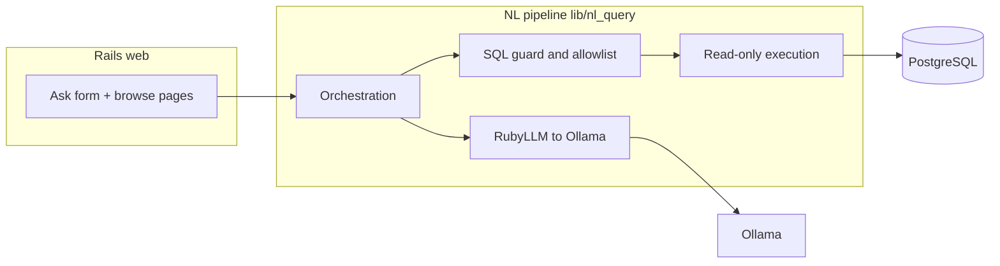

# Ask Data

Rails app that turns natural-language questions into **read-only** PostgreSQL queries, using a local **Ollama** model via **RubyLLM**.

- **Roadmap and tickets:** [`docs/ask-data-plan.md`](docs/ask-data-plan.md)
- **Build log / implementation notes:** [`docs/blog.md`](docs/blog.md)

## Prerequisites

- **Ruby** — version in [`.ruby-version`](.ruby-version) (use rbenv, asdf, etc.)
- **PostgreSQL** — running and reachable per `config/database.yml`
- **Ollama** — installed and running when you want **live** NL→SQL (the test suite stubs the LLM and does not require Ollama)

## Environment variables

| Variable | Purpose |
|----------|---------|
| `OLLAMA_BASE_URL` | Ollama HTTP base (default `http://127.0.0.1:11434`; normalized to include `/v1` for RubyLLM) |
| `OLLAMA_MODEL` | Model id (default `qwen2.5-coder:14b` in code if unset) — run `ollama pull <name>` so it exists locally |
| `RUBYLLM_REQUEST_TIMEOUT` | Optional; request timeout in seconds (default `300` in the initializer) |

## Setup

```bash
git clone <repository-url>
cd ask-data
bundle install
```

Ensure PostgreSQL is up, then:

```bash
bin/rails db:create db:migrate db:seed
# or reset DB + reseed from scratch:
bin/rails db:reset
```

For natural-language asks (not required for `bin/rails test`):

1. Start Ollama (`ollama serve` if it is not already running).
2. Pull the model you configured, e.g. `ollama pull qwen2.5-coder:14b` (or whatever you set in `OLLAMA_MODEL`).

Run the app:

```bash
bin/dev
```

[`Procfile.dev`](Procfile.dev) starts the Rails server, Tailwind watch, and `ollama serve`. If Ollama is already running, you can use `bin/rails server` and, in another terminal, `bin/rails tailwindcss:watch` for CSS.

Open the app in the browser (default port 3000). Root and **`/ask`** show the question form; **`/policy`** describes capabilities; **`/customers`**, **`/products`**, **`/orders`** list seed data.

## Configuration

Edit **`config/nl_query.yml`** to change which tables participate in NL queries, which columns are hidden from the model and from result rows, and execution caps (`statement_timeout_ms`, `max_result_rows`, optional `execution_role`). Restart the app after changes. Run **`bin/rails test`** afterward, especially `test/services/nl_query/`, when you change exposure rules.

## Tests

```bash
bin/rails test
```

Integration tests cover HTTP routes; NL pipeline tests use injected fakes so CI does not need Ollama.

## Security

This app **does not ship with authentication**. It is aimed at local development and trusted networks.

Anyone who can open the UI can run the NL→SQL flow against your Postgres and Ollama. SQL is constrained to **SELECT-only** execution with allowlists and limits (see **Architecture**), but that does **not** stop abuse, cost, or unauthorized use. **Do not expose it to the public internet** without auth, rate limiting, and hardening—or keep access private (VPN, SSH tunnel, etc.).

## Architecture

High-level flow:



| Layer | Role |
|--------|------|
| **Web** | Slim + Tailwind + Stimulus. `QuestionsController` runs the ask flow; `StaticPagesController` serves policy copy; browse controllers expose read-only index tables for sanity checks. |
| **NL pipeline** | Lives under **`lib/nl_query/`** (not `app/services`). Builds a schema snapshot from config + DB metadata, calls the model for SQL, validates with **pg_query** (single `SELECT` / `WITH`, allowlisted relations and columns), then runs the query in a short **read-only** transaction with statement timeout and row cap. |
| **Configuration** | **`config/nl_query.yml`** — which tables/columns are visible to the model and returned to the UI, plus execution limits. **`config/initializers/ruby_llm.rb`** wires RubyLLM to Ollama using env vars below. |
| **Demo data** | Migrations and **`db/seeds`** define a small “mini shop” schema used for development and tests. |

User-facing errors avoid leaking raw SQL or internal details; successful paths redact columns blocked by policy.
