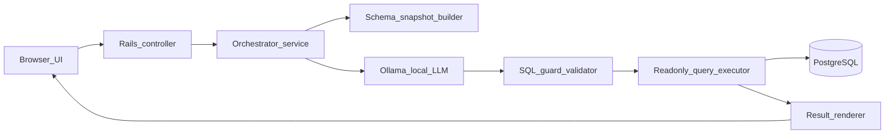

# Ask Data — natural-language database query app — ticket plan (speed-first)

## Product name (locked for blog + GitHub)

- **Display name:** **Ask Data** (UI, README title, blog posts).
- **Repo / directory:** `ask-data` (kebab-case for GitHub and local clone path).
- **Rails app / Ruby module:** `AskData` (e.g. `module AskData` in `config/application.rb`).
- **Optional subtitle** for the UI: “Ask in plain English — read-only answers from your database.”

**Context:** Personal **learning** and **teaching** (blog + GitHub for hobbyists)—**not** a production service you deploy to the public internet. Security model = **runs on your machine** for demos; see **Ticket 1.2** (no auth) and README warning.

---

## Demo domain: fixed schema, seeds, and reference views (locked)

**Why this domain:** A tiny **e-commerce / order** (“mini shop”) dataset is the **fastest** to model in Rails (familiar nouns, no exotic domains) while still exercising everything you need to **stress-test Ask Data**: multi-table **JOINs**, **aggregates** (`SUM`/`COUNT`/`AVG`), `**GROUP BY` / `HAVING`**, **date ranges**, **status filters**, and “**customers with no orders**”-style edge cases. One alternative that is also good (slightly more setup) is **library lending** (loans + due dates); the plan **commits to the mini shop** below so seeds and blog posts stay reproducible.

### Tables and relationships (implement exactly; names matter for NL tuning)


| Model / table               | Purpose                    | Key columns                                                                                                                                                                   |
| --------------------------- | -------------------------- | ----------------------------------------------------------------------------------------------------------------------------------------------------------------------------- |
| `Category` / `categories`   | Product grouping           | `name`                                                                                                                                                                        |
| `Product` / `products`      | Catalog                    | `name`, `sku` (unique), `price_cents`, `category_id` (FK), `created_at`                                                                                                       |
| `Customer` / `customers`    | Buyers (not Devise `User`) | `name`, `email` (unique), `created_at`                                                                                                                                        |
| `Order` / `orders`          | One purchase event         | `customer_id` (FK), `status` (string enum: `pending`, `paid`, `shipped`, `cancelled`), `placed_at` (datetime), `total_cents` (integer; denormalized OK for simpler SUM demos) |
| `OrderItem` / `order_items` | Line items                 | `order_id` (FK), `product_id` (FK), `quantity` (integer ≥ 1), `unit_price_cents` (integer; snapshot at order time)                                                            |


**Indexes:** FKs + `orders.placed_at` + `orders.status` (helps realistic query plans; optional for v1).

**Redaction demo (optional but useful):** add one column that is **never** exposed to the LLM or results, e.g. `customers.internal_memo` (nullable text) or a fake `api_token_digest`—listed in **forbidden** config so blog can show “sensitive column stripped.”

### Seed volumes and edge cases (deterministic)

Use **fixed seeds** (`db/seeds.rb` or split files + `load`) so blog readers and tests get the **same counts**:

- **~8–12** categories with distinct names.
- **~35–50** products spread across categories; **at least 2** products with **zero** line items (never sold).
- **~20–30** customers; **3–5** customers with **zero** orders.
- **~60–100** orders with `placed_at` spanning **at least two calendar years** and crossing month boundaries (e.g. Jan 2024–Mar 2026)—include a cluster of orders **after a specific date** you’ll use in docs (e.g. 2025-12-10).
- **Statuses** not uniform: include `cancelled` and `pending` rows so “excluding cancelled” queries matter.
- **Order items:** 1–5 line items per order; occasionally **two lines for the same product** on different orders (tests join + quantity semantics).
- **One “whale” customer** with many orders + high `total_cents` (nice for `ORDER BY` / `LIMIT` examples).

Document final counts in README (“Seed produces N orders, …”) for reproducibility.

### Reference views + onboarding (ground truth and “what should I ask?”)

**Why both matter:** Read-only **browse** pages give **verifiable truth** (counts, rows, dates) so users can check whether Ask Data’s SQL was right. They do **not** by themselves teach a newcomer **what English questions work**—so the Ask page also needs **starter prompts** (see Ticket 1.3). Together: *suggested questions* → run query → *compare* to browse pages or a mental model of the seed.

Keep CRUD out of scope: **read-only `index` (and optional `show`)** only—no edit forms in v1.

- `**/` or `/ask`** — Ask Data query UI (primary), with **example question chips** (or a small “Try these” list) and **one-line “how to verify”** copy pointing at browse routes.
- `**/customers`**, `**/products`**, `**/orders**` — simple tables (pagination optional) so users can **eyeball** or count whether results match.
- Optional: `**/categories`** index if useful for one blog diagram.

**Acceptance:** A first-time user can pick a suggested question, run it, and **know where to look** (which browse page) to sanity-check the answer without opening `rails console`.

### Example NL questions to tune against (copy into Epic 6 / README)

- “List customers who placed an order after 10 December 2025.”
- “Total revenue (`SUM(order_items.quantity * unit_price_cents)` or `orders.total_cents`) in January 2025.”
- “Top 5 products by units sold.”
- “Orders that include more than one line item.”
- “Customers who have never placed an order.”
- “Average order value by month for shipped orders only.”

---

## Prerequisites (your checklist — do these before / alongside implementation)

Everything below is **on you** unless you explicitly hand it to someone else. Implementation will assume **Ollama** runs locally (or on a URL you provide) and that the listed models are already pulled.

### Machine and runtime

- **macOS/Linux with enough RAM/VRAM** for the models you choose (see below). If inference is slow or OOMs, use a smaller tag or upgrade hardware—implementation cannot fix physics.
- **[Ollama](https://ollama.com)** installed and **running** (`ollama serve` or the macOS app so the HTTP API is up, default `**http://127.0.0.1:11434`**).
- **Ruby** version pinned in `.ruby-version` (added when the app exists) and **Bundler** working (`bundle install`). `**ruby_llm`** requires a **modern Ruby** (check [the gem on RubyGems](https://rubygems.org/gems/ruby_llm) at implementation time—often **≥ 3.1**).
- **PostgreSQL** installed and running; empty DB (or role) ready for `rails db:create db:migrate db:seed` when the app lands.
- **Git** and a directory where the Rails app will live (clone or create when implementation starts).

### Models to download separately (`ollama pull`)

Pull these **before** first end-to-end NL smoke tests. Names/tags must match what Ollama exposes on your machine (`ollama list` after pulling).


| Priority               | Model (example tags) | Role                                                                                                                          |
| ---------------------- | -------------------- | ----------------------------------------------------------------------------------------------------------------------------- |
| **Required**           | `qwen2.5-coder:7b`   | Default **minimum** for dev and smaller machines; code-oriented, reasonable for SQL-ish generation.                           |
| **Recommended**        | `qwen2.5-coder:14b`  | **Better** quality/latency tradeoff if you have ~16GB+ unified/VRAM headroom (adjust if your platform offers different tags). |
| **Optional (quality)** | `qwen2.5-coder:32b`  | Use when you want fewer hallucinations on joins/aggregates and hardware allows.                                               |


**Commands (run once per machine):**

```bash
ollama pull qwen2.5-coder:7b
# optional:
ollama pull qwen2.5-coder:14b
ollama pull qwen2.5-coder:32b
```

**If a tag is unavailable** (Ollama library changes), substitute another **code-focused** model from the Ollama library (e.g. `codellama`, `deepseek-coder`, newer `qwen3-coder` variants) and set the same model name in app config—implementation will read model name from **env**, not hard-code it.

**Sanity check after pulls:**

```bash
ollama run qwen2.5-coder:7b "Reply with OK"
```

### Configuration you will set (no secrets pasted in chat)

- `**OLLAMA_BASE_URL**` (or equivalent): usually `http://127.0.0.1:11434` for local; use a different host if Ollama runs on another box (must be reachable from the Rails process).
- `**OLLAMA_MODEL**`: e.g. `qwen2.5-coder:7b` — must match `**ollama list**` exactly.
- **Rails `DATABASE_URL`** or `config/database.yml`** credentials** for Postgres (local dev).
- **App bind / port** when running the server (e.g. `http://localhost:3000`) for manual or browser-based QA.

### Browser / QA access

- If someone else (or an agent) validates the UI in a browser, **Ollama + Rails must be reachable** from that environment—typically **localhost** on your machine, or a **tunnel** you control if the browser runs elsewhere.

---

## Goals and non-goals (v1)

**Goals**

- You (and blog readers following along) ask questions in plain English; the app returns **tabular results** from the database.
- **Read-only by construction**: validated SQL + execution path that cannot write (still important for teaching safe patterns—even on localhost).
- **Omit/redact** forbidden columns in demo schemas (e.g. password fields) via config so examples mirror real practice.
- **Ship quickly**: minimal vertical slice for **local** use, screenshots, and walkthrough posts—not production deployment.

**Explicitly deferred (Phase 2 — “operational basics”)**

- Persistent audit logs of every question, formal retention policy, rate limiting, monitoring/alerting, heavyweight compliance artifacts (full ADR pack, detailed threat-model doc). v1 can rely on **Rails logs only** and **git history** for prompts.

**Non-goals**

- “Answer anything” without schema support; **clarification / safe failure** when ambiguous (see **Ticket 0.4**).
- Any write path: no `INSERT`/`UPDATE`/`DELETE`, no migrations from this UI.

## Recommended architecture (v1)




**Speed tradeoff:** use one Postgres database for dev/MVP with a **read-only DB user** *if* you can set it up quickly; otherwise start with **validator + `statement_timeout` + row limit** on the normal connection and add the read-only role in Phase 2.

## Epic 0 — Minimal decisions (keep this to one short session)

### Ticket 0.1 — Column allow/deny config (single YAML or Ruby config)

**Description**

- One source of truth: **forbidden** column name patterns / explicit columns (`password_digest`, `encrypted_*`, API keys, etc.) and **allowed** tables for NL queries.
- Skip a formal “stakeholder matrix” document for v1 if speed matters; capture decisions in `config/nl_query.yml` (or similar) + README bullet list.

**Acceptance criteria**

- Changing exposure is a config/code change with a test that proves forbidden columns never appear in results or LLM schema text.

### Ticket 0.2 — RubyLLM (`ruby_llm`) + Ollama provider + env vars

**Description**

- Use the `**[ruby_llm](https://rubygems.org/gems/ruby_llm)`** gem (**RubyLLM**, [rubyllm.com](https://rubyllm.com/)) for **all** LLM calls—do **not** hand-roll raw Faraday/Net::HTTP to Ollama unless the gem cannot do something you need (document the exception if so).
- Configure the **Ollama** provider per RubyLLM docs: base URL (e.g. `http://127.0.0.1:11434`) and **model id** matching a pulled image (e.g. `qwen2.5-coder:7b`). Surface the same settings via **env** (`OLLAMA_BASE_URL`, `OLLAMA_MODEL` or names RubyLLM expects—align README with the gem’s initializer/config pattern).
- Keep a **thin wrapper** (e.g. `TextToSqlPrompt`) that builds system/user messages and parses the model reply into SQL + rationale; **tests** stub or replace the RubyLLM call so CI does **not** need Ollama running.

**Acceptance criteria**

- `Gemfile` includes `ruby_llm` (pin a reasonable version range); app boots with **missing/invalid model or unreachable Ollama** → clear error in dev.
- Automated tests **do not require** Ollama (stub wrapper or RubyLLM test doubles per gem patterns).
- No API key for default local Ollama; if you later use a hosted provider via RubyLLM, wire keys through env (Phase 2 or when needed).

### Ticket 0.3 — Postgres + deterministic mini-shop seeds

**Description**

- Standard Rails + Postgres; implement migrations for **exactly** the tables in **Demo domain** (categories, products, customers, orders, order_items).
- `db/seeds.rb` (or structured loaders) implements the **volumes and edge cases** listed there; README documents resulting **row counts** so blog posts stay reproducible.

**Acceptance criteria**

- `bin/rails db:reset` yields a consistent dataset suitable for the **example NL questions** in the demo section.

### Ticket 0.4 — Accepted scope + product policy (implement, don’t just “know”)

Treat the following as **implementation requirements** (prompts, orchestrator, and UI), not optional prose—same ideas you’d teach readers (safe errors, no SQL leakage, clarify when ambiguous).

**Honest limitations (accepted scope — good enough for v1)**

- **Broad coverage over read-only `SELECT`** is the product bar: filters, joins, aggregates (`COUNT`, `SUM`, …), `GROUP BY`, `ORDER BY`, and sensible date/time interpretation **on allowlisted tables/columns**, as long as the schema supports it.
- The app does **not** promise to understand every possible English phrasing of every business question, nor “general knowledge” outside **your** database.
- Answers are **only** as good as: (a) what exists in the DB, (b) what is included in the **schema snapshot**, and (c) validator + LLM behavior. Out-of-schema entities are out of scope.

**Product policy (must implement)**

- **Ambiguous or underspecified questions:** Prefer **clarification** over a risky guess. UX options: short follow-up prompt (“Did you mean calendar date X in UTC?”), or **2–3 suggested interpretations** the user can click to re-run.
- **Unsupported or unsafe requests:** If the LLM emits invalid/non-`SELECT` SQL, references forbidden tables/columns, or validation fails: show a **safe, non-technical message**; optionally suggest how to rephrase. **Never** expose raw SQL, stack traces, or internal schema dumps to end users.
- **Schema gap:** If the question implies data you don’t store (or not in an exposed table/column), respond plainly that the app can’t answer that from available data.
- **Trust copy:** Where helpful, show a **plain-language interpretation** (“Showing users where `created_at` is after …”) sourced from structured metadata, not free-form LLM invention that could misstate filters.

**Acceptance criteria**

- README or in-app “What this can do” links to this policy in one paragraph.
- Automated or manual tests cover at least: **validator rejection → safe message**; **stubbed LLM returns bad SQL → safe message** (no SQL leakage).
- Prompt template(s) explicitly instruct the model: SELECT-only, use only provided schema, and **ask for clarification or refuse** rather than fabricating tables/columns.

---

## Epic 1 — Rails foundation and UI

### Ticket 1.1 — Rails app scaffold

**Scaffold command (run locally, then hand off the repo)**

From the directory where you want the project folder created:

```bash
rails new ask-data --database=postgresql --css=tailwind
```

This creates the `ask-data/` directory with **PostgreSQL**, **importmap** (default JS), **Hotwire** (default), and **Tailwind** via the Rails CSS setup. The application module name is **AskData** (Rails derives it from `ask-data`).

Optional flags (only if you want them explicitly):

- `--javascript=importmap` — redundant today but documents the choice.
- `--skip-ci` — omit generated GitHub Actions if you do not want CI files yet.

**Owner stops here.** Do **not** add Slim yourself—the **implementer** adds `slim-rails` to the `Gemfile`, runs `bundle install`, converts `application.html.erb` (and related layouts) to `.html.slim`, and uses Slim for all new views. `rails new` does not offer `--slim`.

Use the Ruby your plan targets (e.g. **3.3+**); the implementer will ensure it satisfies **ruby_llm** when that gem is added.

**Description**

- New Rails app, PostgreSQL, Hotwire as needed, minimal lint/test setup.
- **Templates (implementer):** add `gem "slim-rails"` to the Gemfile, replace default ERB layouts with **Slim** (`.html.slim`), **not** ERB for feature views—less verbose markup and lower token load when editing with AI or reading diffs.
- **Styling:** use **[Tailwind CSS](https://tailwindcss.com/)** via the Rails integration ([tailwindcss-rails](https://github.com/rails/tailwindcss-rails); already wired when using `--css=tailwind`). Apply layout and components with **utility classes** in Slim (`class="..."` attributes); avoid large custom CSS files unless necessary for blog clarity.

**Acceptance criteria**

- `bin/rails test` passes in CI/local; layouts and generated views use Slim consistently (implementer removes stray `.html.erb` from the default stack as part of conversion).
- Tailwind is wired (manifest/build pipeline runs in dev/test); Ask + browse pages use Tailwind for tables, forms, nav, and spacing.

### Ticket 1.2 — No authentication (by design)

**Description**

- **Do not** add Devise, sessions, HTTP basic auth, or API tokens for v1. The query UI is **open** on purpose: simplest path for **learning**, reproducing blog steps, and teaching hobbyists running the app on **localhost**.
- **README (required):** prominent **warning** that this stack is **not** safe to expose to the internet as-is; anyone who deploys publicly must add **auth + hardening** (or treat as Phase 2). Clarify that **read-only SQL guards protect the DB from writes, not** “strangers using your app.”

**Acceptance criteria**

- No auth gems, no login routes, no “unauthorized” tests—query page loads without credentials in development.
- README contains the public-exposure warning above.

### Ticket 1.3 — Ask Data query UI + suggested questions + verification hints

**Description**

- Primary page (`/` or `/ask`): question field, submit, loading state, results table, friendly error text (no raw SQL/stack traces to the user)—implemented in **Slim** + **Tailwind** (see 1.1). Style suggested-question chips and results with Tailwind utilities.
- **Suggested questions** (required): surface **6–10** example prompts aligned with the **Demo domain** list (same strings in `config/` or a Ruby constant so README, UI, and tests stay in sync). UX: clickable chips / links that **fill** the textarea (or submit immediately—choose one; filling is usually better for teaching).
- **Verification hints** (short copy on the same page): e.g. “To check orders, open **Browse orders**; for product lists, **Browse products**,” with real `link_to` paths—so users know **how** to validate accuracy.
- Optional: one sentence “What’s in this database?” (mini shop, seed counts from `config` or env) so readers know the domain.

**Acceptance criteria**

- New user can run a suggested question and **without docs** understand **where** to compare results (browse pages).
- Example strings live in one place (DRY with README/Epic 6 golden list if practical).

### Ticket 1.4 — Reference browse pages (read-only)

**Description**

- Implement **read-only** `index` actions (and `show` only if needed) for `customers`, `products`, `orders` (optional `categories`)—simple **Slim** tabular layouts for **blog ground truth** and manual QA (see **Demo domain**).
- **Global nav** (simple header or list): links to Ask Data + **Browse customers / products / orders** so the browse UI is discoverable from the main flow (not a hidden route)—styled with **Tailwind** (responsive, readable tables).

**Acceptance criteria**

- A human can verify seeded totals and spot-check NL answers against these pages without opening `rails console`.
- Browse pages are linked from the Ask page (see Verification hints in 1.3).

---

## Epic 2 — Schema snapshot + LLM

### Ticket 2.1 — Schema snapshot builder

**Description**

- Allowlisted tables/columns + types + PK/FK hints for the LLM; forbidden columns never included.

**Acceptance criteria**

- Unit tests for allowlist and redaction.

### Ticket 2.2 — Text-to-SQL via RubyLLM (Ollama)

**Description**

- Implement the NL→SQL step using `**ruby_llm`**: chat completion against the configured **Ollama** model, with a system prompt (SELECT-only, schema-bound, Ticket 0.4 policy) and a user message containing the question + schema snapshot.
- Parse the assistant reply into **SQL string** + optional **rationale** (strip fenced code blocks if the model wraps SQL in `

```sql `).

- **Tests:** stub the object that invokes RubyLLM (or use gem-supported test helpers if documented) so CI never hits localhost:11434; optional **manual** smoke with real Ollama per prerequisites.

**Acceptance criteria**

- No ad-hoc HTTP client for Ollama in `app/`—RubyLLM is the integration point.
- Unit/integration tests pass without Ollama.

### Ticket 2.3 — Prompts in code (v1)

**Description**

- Prompts live in Ruby files or YAML; **git is the version history**. Defer “prompt version logged to audit table” to Phase 2.

---

## Epic 3 — SQL guardrails (non-negotiable for safety)

### Ticket 3.1 — Parser-based SELECT-only gate

**Description**

- Real SQL parsing for Postgres; reject multi-statement and non-`SELECT` shapes per your policy (`WITH` optional).

**Acceptance criteria**

- Tests for malicious strings (`;`, `DROP`, `INSERT`, etc.).

### Ticket 3.2 — Identifier allowlisting

**Description**

- AST walk: only approved relations/columns; policy on `SELECT` * (deny or expand safely).

### Ticket 3.3 — Timeouts and row cap

**Description**

- `statement_timeout` + `LIMIT` enforcement (append or verify).

### Ticket 3.4 — Read-only execution

**Description**

- Central method that runs only validated SQL; optional read-only DB role when available.

---

## Epic 4 — Orchestration

### Ticket 4.1 — `NaturalLanguageQuery` service

**Description**

- Single pipeline: snapshot → LLM → validate → execute → redact → render Slim / JSON for Turbo as needed (no auth step).

### Ticket 4.2 — Safe errors

**Description**

- User sees generic failure + support id/correlation id in logs only.

### Ticket 4.3 — Result rendering

**Description**

- Stable column order, sensible date/time formatting.

---

## Epic 5 — Tests + browser validation (required for “done”)

This epic is how we prove the thing works without leaning on Phase 2 ops.

### Ticket 5.1 — Automated tests (what to write)

**Description**

- **Unit:** validator (large suite), column redaction, LIMIT enforcement.
- **Integration:** full pipeline with **stubbed LLM** returning fixed SQL strings (good and bad).
- **Optional smoke:** one integration test with VCR against real API marked optional/`--tag slow` if you want.

**Acceptance criteria**

- `bin/rails test` is green without network or secrets.

### Ticket 5.2 — Browser validation runbook (for implementer / agent)

**Description**

- Manual checklist after automated tests:
  - Load query page, submit example: “orders placed after 10 December 2025” (or another **Demo domain** question), verify the results table matches **browse pages** / `rails runner` counts.
  - Confirm forbidden columns never appear.
  - Confirm a rejected/bad SQL path shows safe messaging.

**Acceptance criteria**

- Checklist exists in README under “Manual QA”.

### Ticket 5.3 — What you need to set up so implementation can run tests + browser checks

**Provide or confirm (no secrets pasted in chat):**


| Item                                                                         | Why                                                                                                 |
| ---------------------------------------------------------------------------- | --------------------------------------------------------------------------------------------------- |
| **Ruby version** (`.ruby-version`)                                           | Consistent `bundle install` / tests                                                                 |
| **PostgreSQL** running locally                                               | App + system tests                                                                                  |
| `**.env` or `direnv`** with `OLLAMA_BASE_URL` + `OLLAMA_MODEL`               | **Live** NL smoke (Ollama running + model pulled); CI stays stubbed                                 |
| **Seed data** acceptable for your privacy rules                              | Repeatable demo questions                                                                           |
| **How to boot the server** (`bin/dev` / `rails s`) + **port** (default 3000) | Browser MCP hits `http://localhost:PORT`                                                            |
| If the implementer/agent **cannot** reach your machine’s localhost           | Use **Cloudflare Tunnel**, **ngrok**, or run the same steps on your machine following the checklist |


**Note:** Cursor’s browser tools can drive **your** reachable URL. The agent can run `rails test` and `rails s` in the sandbox **if** the repo and DB exist in that environment; for **your** laptop-only Postgres, you run the server and the agent validates via browser MCP against `localhost` **when** the tooling shares network with your machine (when it doesn’t, you execute the checklist or expose a tunnel).

---

## Epic 6 — Slim quality gate (recommended, not bloated)

### Ticket 6.1 — Small “golden” set

**Description**

- 10–30 seeded questions with expected row counts or “must include columns” assertions—run in CI with stubbed LLM or deterministic SQL injection for harness only.

### Ticket 6.2 — Defer human review workflow

**Description**

- Skip internal “failure triage UI” for v1; use issues + log grep.

---

## Phase 2 — Operational basics (when you’re ready)

- **Authentication / authorization** if you ever expose the app beyond localhost.
- Audit log table + optional SQL text storage (access-controlled).
- Rate limiting (Rack::Attack or similar).
- Metrics/alerts; formal ADR/threat model if compliance requires it.
- Read replica wiring.

---

## Dependency order (speed path)

1. Epic 0 minimal config + Ollama env + **scope/product policy (Ticket 0.4)** — prerequisites at top of this doc
2. Epic 1 scaffold + UI (**no auth**; README warning)
3. Epic 2 schema + RubyLLM/Ollama text-to-SQL (stubbed tests)
4. Epic 3 validators + execution
5. Epic 4 orchestrator
6. Epic 5 automated tests + README manual QA + your local env for smoke
7. Epic 6 small golden set (optional but cheap insurance)

---

## Optional future (unchanged idea list)

- Semantic layer / predefined metrics for KPI questions.
- Row-level tenant filters injected without LLM string concat.
- Embeddings over internal glossary for terminology.

